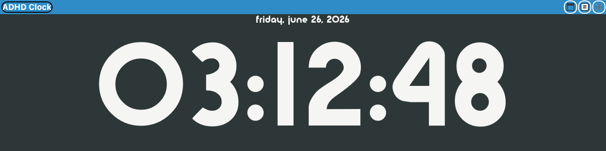
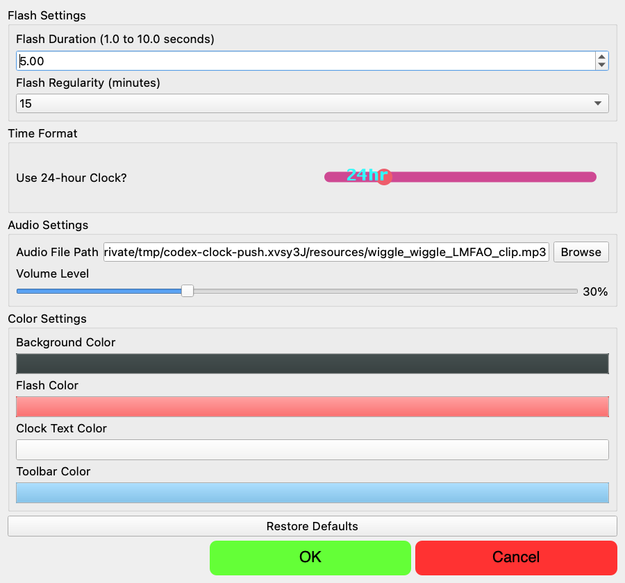

# Big Clock

Big Clock is a PyQt5 desktop clock I built for a tiny second monitor, roughly 2 inches tall by 8 inches wide. It turns that screen into a big, readable time anchor with gentle-but-hard-to-miss reminders for time blindness.



## What It Does

- Displays a large auto-scaling digital clock and date.
- Moves itself to an extended monitor when one is available.
- Falls back to a bottom-of-screen strip when only one monitor is connected.
- Flashes at a configurable interval, with my default set to every 15 minutes.
- Plays an hourly attention cue with animated text.
- Supports 12-hour and 24-hour time.
- Lets you customize flash duration, flash cadence, colors, audio file, and volume.
- Packages as a macOS app bundle with PyInstaller.



## Why I Made It

I wanted a low-friction, always-visible clock that helps me notice time passing without adding another phone notification or calendar popup. The design goal is simple: make the current time impossible to miss, but keep it cute enough that I actually want it running all day.

## Requirements

- Python 3
- PyQt5
- PyInstaller, if you want to build the macOS app bundle

Install the project dependencies:

```bash
python -m venv venv
source venv/bin/activate
pip install -r requirements.txt
```

## Run Locally

```bash
source venv/bin/activate
python bigclock.py
```

The app opens with a settings dialog. Accept the settings to launch the clock.

## Build The App

```bash
source venv/bin/activate
pyinstaller bigclock.spec
```

The built macOS app bundle is written to `dist/bigclock.app`.

## Capture Screenshots

Use the checked-in screenshot script so the README and portfolio images can be regenerated consistently:

```bash
./capture-screenshots.sh
```

The script writes PNG files to `screenshots/`. You can override the interpreter or output directory:

```bash
PYTHON_BIN=/path/to/python OUT_DIR=/path/to/screenshots ./capture-screenshots.sh
```
